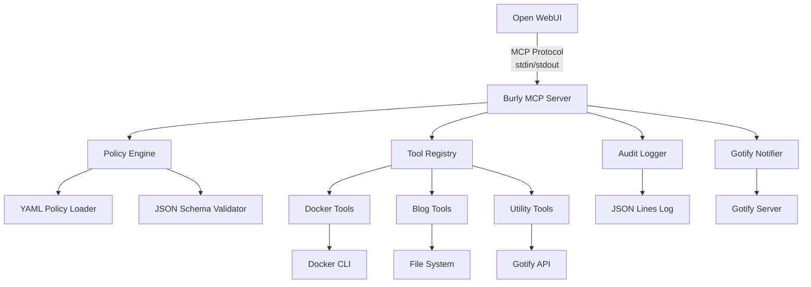

# Design Document

## Overview

Burly MCP is a containerized Python application that implements the Model Context Protocol (MCP) to provide secure, policy-driven access to system operations. The server runs as a non-privileged service that communicates via stdin/stdout and executes only whitelisted operations defined in YAML policy files.

## Architecture



## Components and Interfaces

### MCP Protocol Handler
- **Purpose**: Implements MCP standard for list_tools and call_tool operations
- **Interface**: JSON messages via stdin/stdout
- **Responsibilities**:
  - Parse incoming MCP requests
  - Route to appropriate tool handlers
  - Format responses according to MCP specification
  - Handle confirmation workflow for mutating operations

### Policy Engine
- **Purpose**: Enforces security policies and validates tool execution
- **Configuration**: `policy/tools.yaml` with per-tool definitions
- **Responsibilities**:
  - Load and validate tool policies at startup
  - Validate tool arguments against JSON schemas
  - Enforce timeout and output limits
  - Check path traversal and security constraints

### Tool Registry
- **Purpose**: Manages available tools and their execution
- **Tools**:
  - `docker_ps`: Execute Docker CLI for container listing
  - `disk_space`: Run filesystem usage commands
  - `blog_stage_markdown`: Validate Markdown front-matter
  - `blog_publish_static`: Copy files with confirmation
  - `gotify_ping`: Send test notifications
- **Interface**: Uniform tool execution with timeout and output handling

### Audit System
- **Purpose**: Log all operations for security and monitoring
- **Format**: JSON Lines with structured fields
- **Fields**: timestamp, tool, args_hash, status, metrics, caller
- **Storage**: `/var/log/agentops/audit.jsonl`

### Notification System
- **Purpose**: Optional Gotify integration for operation alerts
- **Configuration**: Environment variables for URL and token
- **Priorities**: success=3, need_confirm=5, failure=8
- **Failure Handling**: Log warnings but don't block operations

## Data Models

### Tool Definition
```python
@dataclass
class ToolDefinition:
    name: str
    description: str
    args_schema: dict
    command: List[str]
    mutates: bool
    requires_confirm: bool
    timeout_sec: int
    notify: List[str]
```

### MCP Request/Response
```python
@dataclass
class MCPRequest:
    method: str
    name: Optional[str]
    args: Optional[dict]

@dataclass
class MCPResponse:
    ok: bool
    need_confirm: bool
    summary: str
    data: Optional[dict]
    stdout: str
    stderr: str
    metrics: dict
```

### Audit Record
```python
@dataclass
class AuditRecord:
    ts: str  # ISO-8601 UTC
    tool: str
    args_hash: str  # SHA-256 of sanitized args
    mutates: bool
    requires_confirm: bool
    status: str  # ok|fail|need_confirm
    exit_code: int
    elapsed_ms: int
    caller: str
    stdout_trunc: int
    stderr_trunc: int
```

## Error Handling

### Policy Violations
- Invalid tool names return available tools list
- Schema validation failures return specific field errors
- Path traversal attempts logged and rejected
- Timeout exceeded returns partial output with timeout indicator

### System Errors
- Command execution failures captured with exit codes
- Docker socket access errors handled gracefully
- File system permission errors logged with context
- Network failures for Gotify logged as warnings

### MCP Protocol Errors
- Malformed JSON requests return protocol error responses
- Missing required fields handled with descriptive messages
- Invalid method names return supported methods list

## Testing Strategy

### Unit Tests
- Policy loader with valid/invalid YAML files
- JSON schema validation with edge cases
- Tool execution with mocked commands
- Audit record generation and formatting
- Path traversal prevention

### Integration Tests
- Full MCP request/response cycle
- Docker CLI integration with test containers
- File system operations with temporary directories
- Gotify notification delivery
- Confirmation workflow for mutating operations

### Security Tests
- Privilege escalation attempts
- Path traversal attack vectors
- Command injection prevention
- Resource exhaustion (timeout/output limits)
- Environment variable exposure

### Container Tests
- Non-root user execution
- Mount point access controls
- Network isolation verification
- Resource limit enforcement