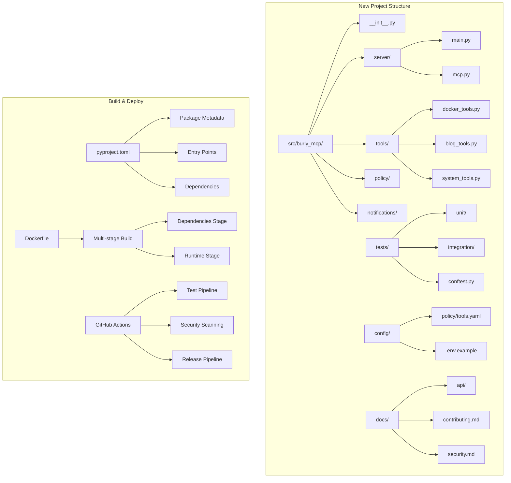

# Design Document

## Overview

This design outlines the comprehensive restructuring of the Burly MCP project to follow Python packaging best practices, fix Docker build issues, and establish a production-ready development workflow. The restructuring will transform the current flat structure into a proper Python package with clear module boundaries, automated testing, and secure deployment practices.

## Architecture



## Components and Interfaces

### Package Structure

**New Directory Layout:**
```
burly-mcp/
├── src/
│   └── burly_mcp/
│       ├── __init__.py
│       ├── server/
│       │   ├── __init__.py
│       │   ├── main.py
│       │   └── mcp.py
│       ├── tools/
│       │   ├── __init__.py
│       │   ├── docker_tools.py
│       │   ├── blog_tools.py
│       │   └── system_tools.py
│       ├── policy/
│       │   ├── __init__.py
│       │   └── engine.py
│       └── notifications/
│           ├── __init__.py
│           └── gotify.py
├── tests/
│   ├── unit/
│   ├── integration/
│   └── conftest.py
├── config/
│   ├── policy/
│   │   └── tools.yaml
│   └── .env.example
├── docs/
│   ├── api/
│   ├── contributing.md
│   └── security.md
├── docker/
│   ├── Dockerfile
│   └── docker-compose.yml
├── .github/
│   └── workflows/
├── pyproject.toml
└── README.md
```

### Module Organization

**Core Package (`src/burly_mcp/`)**
- **Purpose**: Main application package with clear module boundaries
- **Interface**: Public API exposed through `__init__.py`
- **Responsibilities**:
  - Define package version and metadata
  - Expose main entry points
  - Provide clean import paths

**Server Module (`src/burly_mcp/server/`)**
- **Purpose**: MCP protocol implementation and main application logic
- **Interface**: `main()` function as primary entry point
- **Responsibilities**:
  - MCP request/response handling
  - Application lifecycle management
  - Component orchestration

**Tools Module (`src/burly_mcp/tools/`)**
- **Purpose**: Individual tool implementations
- **Interface**: Standardized tool interface with registration system
- **Responsibilities**:
  - Docker operations
  - Blog management
  - System monitoring
  - Tool discovery and execution

### Build System Design

**Multi-stage Dockerfile with Build Cache Optimization:**
```dockerfile
# Dependencies stage
FROM python:3.12-slim as dependencies
WORKDIR /app

# Install system dependencies first (rarely change)
RUN apt-get update && apt-get install -y --no-install-recommends \
    gcc \
    && rm -rf /var/lib/apt/lists/*

# Copy and install Python dependencies (cache layer)
COPY pyproject.toml ./
RUN pip install --no-cache-dir --upgrade pip setuptools wheel
RUN pip install --no-cache-dir -e .

# Runtime stage  
FROM python:3.12-slim as runtime
RUN useradd -u 1000 -m agentops --shell /bin/bash
WORKDIR /app

# Copy installed packages from dependencies stage
COPY --from=dependencies /usr/local/lib/python3.12/site-packages /usr/local/lib/python3.12/site-packages
COPY --from=dependencies /usr/local/bin /usr/local/bin

# Copy application code (changes frequently)
COPY src/ ./src/
COPY config/ ./config/

# Set environment variables
ENV BURLY_CONFIG_DIR=/app/config \
    BURLY_LOG_DIR=/var/log/agentops \
    PYTHONPATH=/app/src \
    PYTHONUNBUFFERED=1

# Create log directory with proper permissions
RUN mkdir -p /var/log/agentops && chown agentops:agentops /var/log/agentops

USER agentops
ENTRYPOINT ["python", "-m", "burly_mcp.server.main"]
```

**Package Configuration (`pyproject.toml`):**
```toml
[build-system]
requires = ["setuptools>=68.0", "wheel"]
build-backend = "setuptools.build_meta"

[project]
name = "burly-mcp"
dynamic = ["version"]
description = "Secure MCP server for system operations"
dependencies = [
    "mcp>=0.1.0",
    "pydantic>=2.0.0",
    "pyyaml>=6.0",
]

[project.scripts]
burly-mcp = "burly_mcp.server.main:main"

[tool.setuptools.dynamic]
version = {attr = "burly_mcp.__version__"}
```

## Data Models

### Package Metadata
```python
# src/burly_mcp/__init__.py
__version__ = "1.0.0"
__author__ = "Burly MCP Team"
__description__ = "Secure MCP server for system operations"

from .server.main import main
from .tools import ToolRegistry
from .policy import PolicyEngine

__all__ = ["main", "ToolRegistry", "PolicyEngine"]
```

### Module Interfaces
```python
# src/burly_mcp/tools/__init__.py
from .docker_tools import DockerTools
from .blog_tools import BlogTools
from .system_tools import SystemTools

class ToolRegistry:
    def __init__(self):
        self.tools = {
            "docker": DockerTools(),
            "blog": BlogTools(), 
            "system": SystemTools(),
        }
    
    def get_tool(self, name: str):
        return self.tools.get(name)
```

### Configuration Management
```python
# src/burly_mcp/config.py
from pathlib import Path
from typing import Optional
import os
from dataclasses import dataclass

@dataclass
class Config:
    """Centralized configuration management with environment variable support"""
    
    def __init__(self):
        # Core paths
        self.config_dir = Path(os.getenv("BURLY_CONFIG_DIR", "/app/config"))
        self.policy_file = self.config_dir / "policy" / "tools.yaml"
        self.log_dir = Path(os.getenv("BURLY_LOG_DIR", "/var/log/agentops"))
        
        # Docker configuration
        self.docker_socket = os.getenv("DOCKER_SOCKET", "/var/run/docker.sock")
        self.docker_timeout = int(os.getenv("DOCKER_TIMEOUT", "30"))
        
        # Security settings
        self.max_output_size = int(os.getenv("MAX_OUTPUT_SIZE", "1048576"))  # 1MB
        self.audit_enabled = os.getenv("AUDIT_ENABLED", "true").lower() == "true"
        
        # Notification settings
        self.gotify_url = os.getenv("GOTIFY_URL")
        self.gotify_token = os.getenv("GOTIFY_TOKEN")
        
        # Blog settings
        self.blog_stage_root = Path(os.getenv("BLOG_STAGE_ROOT", "/app/blog/stage"))
        self.blog_publish_root = Path(os.getenv("BLOG_PUBLISH_ROOT", "/app/blog/publish"))
        
    def validate(self) -> list[str]:
        """Validate configuration and return list of errors"""
        errors = []
        
        if not self.config_dir.exists():
            errors.append(f"Config directory not found: {self.config_dir}")
        
        if not self.policy_file.exists():
            errors.append(f"Policy file not found: {self.policy_file}")
            
        if self.gotify_url and not self.gotify_token:
            errors.append("GOTIFY_TOKEN required when GOTIFY_URL is set")
            
        return errors
```

## Error Handling

### Import Resolution
- **Module Not Found**: Clear error messages with suggested fixes
- **Circular Imports**: Prevented through proper dependency injection
- **Path Issues**: Eliminated through proper package structure

### Docker Build Failures
- **Missing Files**: Comprehensive `.dockerignore` and build context validation
- **Permission Issues**: Proper user/group management in container
- **Dependency Conflicts**: Locked dependency versions and virtual environments

### Development Environment
- **Path Configuration**: Eliminated need for PYTHONPATH manipulation
- **Test Discovery**: Automatic test discovery through pytest conventions
- **Import Errors**: Clear package boundaries prevent import confusion

## Testing Strategy

### Unit Tests Structure
```
tests/
├── unit/
│   ├── test_server/
│   │   ├── test_main.py
│   │   └── test_mcp.py
│   ├── test_tools/
│   │   ├── test_docker_tools.py
│   │   └── test_blog_tools.py
│   └── test_policy/
│       └── test_engine.py
├── integration/
│   ├── test_docker_integration.py
│   └── test_mcp_protocol.py
└── conftest.py
```

### Test Configuration
```python
# tests/conftest.py
import pytest
from pathlib import Path
from burly_mcp.config import Config

@pytest.fixture
def test_config():
    return Config(config_dir=Path(__file__).parent / "fixtures")

@pytest.fixture
def mock_docker():
    # Mock Docker client for unit tests
    pass
```

### CI/CD Pipeline
```yaml
# .github/workflows/test.yml
name: Test and Security
on: [push, pull_request]

jobs:
  test:
    runs-on: ubuntu-latest
    steps:
      - uses: actions/checkout@v4
      - uses: actions/setup-python@v5
        with:
          python-version: '3.12'
      - name: Install dependencies
        run: |
          pip install --upgrade pip setuptools wheel
          pip install -e .[dev]
      - name: Run tests with coverage
        run: pytest --cov=burly_mcp --cov-report=xml --cov-report=html --cov-fail-under=80
      - name: Upload coverage to Codecov
        uses: codecov/codecov-action@v4
        with:
          file: ./coverage.xml
      - name: Security scanning
        run: |
          pip-audit --desc --format=json
          bandit -r src/ -f json -o bandit-report.json
          safety check --json
      - name: Docker integration tests
        run: |
          docker-compose -f docker/docker-compose.test.yml up --build --abort-on-container-exit
      - name: Docker security scan
        run: |
          docker build -t burly-mcp:test .
          trivy image --exit-code 1 --severity HIGH,CRITICAL burly-mcp:test
      - name: Generate documentation
        run: |
          sphinx-build -b html docs/ docs/_build/html
```

## Security Implementation

### Container Security
- **Non-root Execution**: User `agentops` (uid 1000) with minimal privileges and no sudo access
- **Capability Dropping**: Remove unnecessary Linux capabilities (`--cap-drop=ALL --cap-add=CHOWN,SETUID,SETGID`)
- **Read-only Filesystem**: Mount application code as read-only with writable `/tmp` and log directories
- **Secret Management**: Docker secrets for production, environment variables for development (never hardcoded)
- **Network Isolation**: No exposed ports, communication via stdin/stdout only
- **Resource Limits**: Memory and CPU limits enforced via Docker constraints

### Docker Secrets Integration
```yaml
# docker-compose.yml
services:
  burly-mcp:
    build: .
    secrets:
      - gotify_token
      - docker_socket_access
    environment:
      - GOTIFY_TOKEN_FILE=/run/secrets/gotify_token
    volumes:
      - /var/run/docker.sock:/var/run/docker.sock:ro
    security_opt:
      - no-new-privileges:true
    cap_drop:
      - ALL
    cap_add:
      - CHOWN
      - SETUID
      - SETGID

secrets:
  gotify_token:
    external: true
  docker_socket_access:
    external: true
```

### Code Security
- **Dependency Scanning**: Automated vulnerability scanning with pip-audit
- **Static Analysis**: Bandit for Python security issues
- **Image Scanning**: Trivy for container vulnerabilities
- **Secret Detection**: Pre-commit hooks to prevent credential leaks

### Runtime Security
```python
# src/burly_mcp/security.py
import os
from pathlib import Path

class SecurityValidator:
    def __init__(self):
        self.allowed_paths = [
            Path("/app/config"),
            Path("/var/log/agentops"),
        ]
    
    def validate_path(self, path: Path) -> bool:
        """Prevent path traversal attacks"""
        try:
            resolved = path.resolve()
            return any(resolved.is_relative_to(allowed) for allowed in self.allowed_paths)
        except (OSError, ValueError):
            return False
```

## Migration Strategy

### Phase 1: Structure Setup
1. Create new directory structure with proper Python package layout
2. Move existing files to appropriate locations (`server/` → `src/burly_mcp/server/`)
3. Add `__init__.py` files for package structure with proper exports
4. Update all imports throughout codebase to use absolute imports
5. Create development environment setup documentation

### Phase 2: Build System & Configuration
1. Create `pyproject.toml` with proper configuration, dependencies, and entry points
2. Update Dockerfile for multi-stage builds with build cache optimization
3. Configure console scripts and package metadata
4. Create comprehensive `.env.example` with all configurable variables
5. Test package installation and imports in clean environment

### Phase 3: Testing & CI/CD
1. Reorganize tests into unit/integration structure
2. Configure pytest with coverage reporting (minimum 80% coverage)
3. Set up GitHub Actions workflows with security scanning
4. Add Docker test containers for integration testing
5. Configure automated documentation generation with Sphinx

### Phase 4: Security & Production Readiness
1. Implement Docker secrets management
2. Add comprehensive security scanning (Trivy, Bandit, pip-audit)
3. Configure role-based access controls where applicable
4. Set up automated vulnerability monitoring
5. Create security documentation and threat model

### Phase 5: Documentation & Developer Experience
1. Create comprehensive contributor guidelines with:
   - Code style guidelines (PEP 8, Black formatting)
   - Testing requirements and local development setup
   - Pull request process and review guidelines
   - Issue tracking and labeling conventions
2. Set up automated API documentation generation
3. Create deployment guides for different environments
4. Validate end-to-end developer workflows

### Development Environment Setup
```bash
# Local development setup
git clone <repository>
cd burly-mcp
python -m venv .venv
source .venv/bin/activate  # or .venv\Scripts\activate on Windows
pip install -e .[dev]
pre-commit install
pytest  # Run tests to validate setup
```

## Validation Criteria

### Build Validation
- Docker builds successfully from project root
- Python package installs without path manipulation
- All imports work using standard Python syntax
- Entry points function correctly

### Security Validation
- Container runs as non-root user
- No secrets in source code or images
- Vulnerability scans pass with no HIGH/CRITICAL issues
- Security configurations validate on startup

### Development Validation
- Tests run from project root without configuration
- Linting and formatting tools work correctly
- CI/CD pipeline completes successfully
- Documentation builds and deploys properly