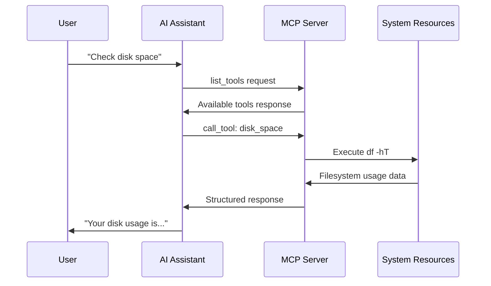

# Understanding the Model Context Protocol (MCP)

## What is MCP?

The Model Context Protocol (MCP) is a standardized way for AI assistants to safely interact with external tools and services. Think of it as a secure bridge between AI systems and the real world, allowing AI assistants to perform actions beyond just generating text.

## Why MCP Matters

### The Problem MCP Solves

Before MCP, AI assistants were limited to:
- Generating text responses
- Working with information provided in the conversation
- Unable to interact with external systems safely

This meant you couldn't ask an AI to:
- "Check my server's disk space"
- "List my running Docker containers"
- "Publish my blog post"
- "Send me a notification when this completes"

### The MCP Solution

MCP provides a standardized protocol that allows AI assistants to:
- **Discover available tools**: "What can I help you with?"
- **Execute operations safely**: With built-in security and confirmation workflows
- **Provide structured responses**: Consistent, parseable results
- **Maintain audit trails**: Track what was done and when

## How MCP Works

### The Communication Flow



### Key Components

#### 1. MCP Server (Burly MCP)
- Hosts the available tools
- Enforces security policies
- Executes operations safely
- Provides audit logging

#### 2. MCP Client (AI Assistant)
- Discovers available tools
- Makes tool execution requests
- Handles confirmation workflows
- Presents results to users

#### 3. Protocol Messages
- **list_tools**: Discover what operations are available
- **call_tool**: Execute a specific operation
- **Responses**: Structured results with success/failure status

## MCP Message Format

### Tool Discovery Request
```json
{
  "method": "list_tools"
}
```

### Tool Discovery Response
```json
{
  "tools": [
    {
      "name": "disk_space",
      "description": "Show filesystem usage summary",
      "inputSchema": {
        "type": "object",
        "properties": {},
        "additionalProperties": false
      }
    }
  ]
}
```

### Tool Execution Request
```json
{
  "method": "call_tool",
  "params": {
    "name": "disk_space",
    "arguments": {}
  }
}
```

### Tool Execution Response
```json
{
  "content": [
    {
      "type": "text",
      "text": "Filesystem usage:\n/dev/sda1: 45% used (12GB/27GB)"
    }
  ],
  "isError": false
}
```

## Security in MCP

### Built-in Safety Features

#### 1. Tool Whitelisting
Only explicitly defined tools are available:
```yaml
# Only these tools can be executed
tools:
  - docker_ps      # Safe: read-only
  - disk_space     # Safe: read-only
  - blog_publish   # Requires confirmation
```

#### 2. Argument Validation
All inputs are validated against schemas:
```yaml
args_schema:
  type: "object"
  properties:
    file_path:
      type: "string"
      pattern: "^[a-zA-Z0-9._/-]+\\.md$"  # Only safe file paths
```

#### 3. Confirmation Workflows
Dangerous operations require explicit confirmation:
```json
{
  "method": "call_tool",
  "params": {
    "name": "blog_publish_static",
    "arguments": {
      "source_dir": "my-post",
      "_confirm": true  // Must be explicitly set
    }
  }
}
```

#### 4. Audit Logging
Every operation is logged:
```json
{
  "timestamp": "2024-01-15T10:30:00Z",
  "tool": "blog_publish_static",
  "status": "success",
  "user": "ai-assistant",
  "duration_ms": 1250
}
```

## MCP vs Other Approaches

### Traditional API Integration
```
❌ Each AI system needs custom integration
❌ No standardized security model
❌ Difficult to audit and monitor
❌ Limited tool discovery
```

### MCP Approach
```
✅ Standardized protocol works with any MCP-compatible AI
✅ Built-in security and confirmation workflows
✅ Comprehensive audit trails
✅ Dynamic tool discovery
✅ Consistent error handling
```

## Real-World Example: Blog Publishing

Let's walk through a complete blog publishing workflow:

### 1. User Request
"Please validate and publish my latest blog post from the staging directory"

### 2. AI Discovery
```json
// AI asks: What tools are available?
{"method": "list_tools"}

// Server responds with available tools including:
{
  "name": "blog_stage_markdown",
  "description": "Validate Markdown file front-matter"
}
```

### 3. Validation Step
```json
// AI validates the content first
{
  "method": "call_tool",
  "params": {
    "name": "blog_stage_markdown",
    "arguments": {"file_path": "my-post.md"}
  }
}

// Server responds with validation results
{
  "content": [{"type": "text", "text": "✅ Front-matter valid"}],
  "isError": false
}
```

### 4. Confirmation Required
```json
// AI attempts to publish
{
  "method": "call_tool",
  "params": {
    "name": "blog_publish_static",
    "arguments": {"source_dir": "my-post"}
  }
}

// Server requires confirmation
{
  "content": [{"type": "text", "text": "This will publish files to production. Confirm?"}],
  "isError": false,
  "needsConfirmation": true
}
```

### 5. Confirmed Execution
```json
// AI makes confirmed request
{
  "method": "call_tool",
  "params": {
    "name": "blog_publish_static",
    "arguments": {
      "source_dir": "my-post",
      "_confirm": true
    }
  }
}

// Server executes and responds
{
  "content": [{"type": "text", "text": "✅ Published 3 files successfully"}],
  "isError": false
}
```

## Benefits of MCP for Users

### 1. Natural Language Interface
Instead of learning command-line syntax:
```bash
# Traditional approach
docker ps --format "table {{.Names}}\t{{.Status}}"
df -hT
```

You can simply ask:
```
"Show me my running containers and disk usage"
```

### 2. Safety by Design
- Operations are validated before execution
- Dangerous actions require confirmation
- Everything is logged for audit
- Failures are handled gracefully

### 3. Consistent Experience
- Same interface works across different AI assistants
- Predictable response formats
- Standardized error handling
- Reliable tool discovery

### 4. Extensibility
- New tools can be added easily
- Custom workflows can be built
- Integration with existing systems
- Scalable architecture

## MCP Best Practices

### For Users
1. **Understand confirmations**: When an AI asks for confirmation, review what will happen
2. **Check audit logs**: Regularly review what operations were performed
3. **Start small**: Begin with read-only operations before using mutating tools
4. **Trust but verify**: Confirm results of operations when possible

### For Administrators
1. **Principle of least privilege**: Only enable tools that are actually needed
2. **Regular audits**: Review logs for unusual patterns
3. **Keep policies updated**: Adjust tool configurations as needs change
4. **Monitor resource usage**: Ensure tools aren't consuming excessive resources

## Common MCP Patterns

### Read-Only Operations
- System monitoring (disk space, processes)
- Configuration validation
- Log analysis
- Status checks

### Mutating Operations with Confirmation
- File publishing
- Service restarts
- Configuration changes
- Data modifications

### Notification Integration
- Success/failure alerts
- Operation summaries
- Error notifications
- Audit trail updates

## Troubleshooting MCP

### Common Issues

**Tool not found:**
```json
{"error": "Tool 'unknown_tool' not found", "available": ["docker_ps", "disk_space"]}
```
*Solution*: Check available tools with list_tools

**Validation failed:**
```json
{"error": "Invalid file_path: must match pattern ^[a-zA-Z0-9._/-]+\\.md$"}
```
*Solution*: Ensure arguments match the required schema

**Confirmation required:**
```json
{"needsConfirmation": true, "message": "This operation will modify files"}
```
*Solution*: Add `"_confirm": true` to arguments

**Timeout exceeded:**
```json
{"error": "Operation timed out after 30 seconds"}
```
*Solution*: Check if operation is stuck or needs longer timeout

## The Future of MCP

MCP represents a fundamental shift in how AI assistants interact with the world. As the protocol evolves, we can expect:

- **Broader adoption**: More AI systems and tools supporting MCP
- **Enhanced security**: Advanced authentication and authorization
- **Richer interactions**: Support for streaming, file uploads, and complex workflows
- **Better tooling**: Development frameworks and debugging tools

Burly MCP is designed to be a practical introduction to this powerful protocol, demonstrating how AI assistants can safely and effectively interact with real-world systems.

## Getting Started

Ready to try MCP? Here's what to do next:

1. **Deploy Burly MCP**: Follow the deployment guide in `docs/runbook.md`
2. **Configure your AI**: Set up MCP integration in your AI assistant
3. **Start simple**: Try read-only operations like `docker_ps` and `disk_space`
4. **Explore safely**: Use confirmation workflows for mutating operations
5. **Monitor and learn**: Review audit logs to understand what's happening

MCP opens up a world of possibilities for AI-assisted system administration, content management, and automation. Welcome to the future of AI-human collaboration!