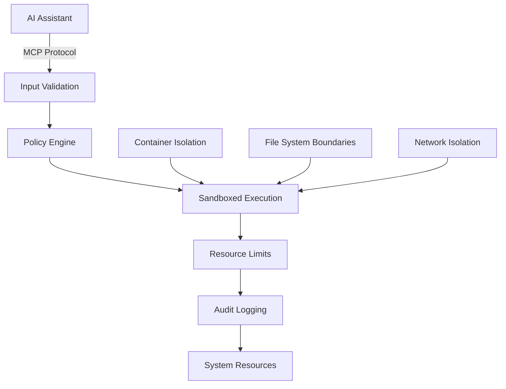

# Security Guide

## Overview

Burly MCP is designed with security as a primary concern, implementing defense-in-depth strategies to safely enable AI assistants to perform system operations. This document outlines the threat model, security controls, and mitigation strategies.

## Threat Model

### Assets Protected
- **Host system**: Files, processes, and system resources
- **Docker environment**: Containers and Docker daemon
- **Blog content**: Staged and published content
- **Audit logs**: Operation history and security events
- **Configuration**: Policy files and environment settings

### Threat Actors
- **Malicious AI prompts**: Attempts to manipulate the AI into performing unauthorized actions
- **Compromised AI assistant**: AI system that has been compromised or is behaving unexpectedly
- **External attackers**: Network-based attacks against the MCP server
- **Insider threats**: Authorized users attempting to exceed their permissions
- **Supply chain attacks**: Compromised dependencies or container images

### Attack Vectors
- **Command injection**: Attempts to execute arbitrary commands
- **Path traversal**: Attempts to access files outside allowed directories
- **Resource exhaustion**: Attempts to consume excessive CPU, memory, or disk
- **Privilege escalation**: Attempts to gain higher system privileges
- **Data exfiltration**: Attempts to read sensitive system information
- **Configuration tampering**: Attempts to modify security policies

## Security Architecture

### Defense Layers



### Security Controls

#### 1. Input Validation and Sanitization
- **JSON Schema Validation**: All tool arguments validated against strict schemas
- **Pattern Matching**: File paths restricted to safe character sets
- **Length Limits**: Input size limits prevent buffer overflow attacks
- **Type Checking**: Strong typing prevents injection attacks

#### 2. Policy-Based Access Control
- **Whitelist Approach**: Only explicitly defined tools are available
- **Granular Permissions**: Each tool has specific capabilities and restrictions
- **Confirmation Gates**: Mutating operations require explicit confirmation
- **Schema Enforcement**: Tool arguments must match predefined schemas

#### 3. Container Isolation
- **Non-root Execution**: Runs as unprivileged user (uid 1000)
- **Read-only Filesystem**: Container filesystem is immutable
- **No New Privileges**: Prevents privilege escalation within container
- **Resource Limits**: CPU and memory usage constrained

#### 4. File System Security
- **Path Traversal Prevention**: All file operations validated against allowed roots
- **Directory Boundaries**: Blog operations confined to specific directories
- **Mount Restrictions**: Volumes mounted with minimal necessary permissions
- **Symbolic Link Protection**: Prevents symlink-based path traversal

#### 5. Process Isolation
- **Command Whitelisting**: Only predefined commands can be executed
- **Timeout Enforcement**: All operations have maximum execution time
- **Output Truncation**: Prevents memory exhaustion from verbose output
- **Signal Handling**: Proper cleanup on termination

## Specific Threat Mitigations

### Command Injection Prevention

**Threat**: Malicious input attempting to execute arbitrary commands
```
# Malicious attempt
{"file_path": "test.md; rm -rf /"}
```

**Mitigation**:
- JSON Schema pattern validation restricts file paths to safe characters
- No shell interpretation - commands executed directly via subprocess
- Argument validation prevents command chaining

```yaml
# Schema prevents injection
file_path:
  type: "string"
  pattern: "^[a-zA-Z0-9._/-]+\\.md$"  # Only safe characters
```

### Path Traversal Prevention

**Threat**: Attempts to access files outside allowed directories
```
# Malicious attempt
{"file_path": "../../../etc/passwd"}
```

**Mitigation**:
- All file paths resolved and validated against allowed roots
- Symbolic links resolved before path checking
- Container filesystem boundaries enforced

```python
# Path validation example
def validate_path(path: str, allowed_root: str) -> bool:
    resolved = os.path.realpath(path)
    allowed = os.path.realpath(allowed_root)
    return resolved.startswith(allowed + os.sep)
```

### Resource Exhaustion Prevention

**Threat**: Attempts to consume excessive system resources

**Mitigations**:
- **CPU Limits**: Container limited to 0.5 CPU cores
- **Memory Limits**: Container limited to 512MB RAM
- **Timeout Enforcement**: All operations terminated after configured timeout
- **Output Truncation**: Large outputs truncated to prevent memory exhaustion

```yaml
# Docker resource limits
deploy:
  resources:
    limits:
      memory: 512M
      cpus: '0.5'
```

### Privilege Escalation Prevention

**Threat**: Attempts to gain higher system privileges

**Mitigations**:
- **Non-root User**: Container runs as uid 1000 with no sudo access
- **No New Privileges**: Container security option prevents privilege escalation
- **Read-only Filesystem**: Prevents modification of system files
- **Minimal Capabilities**: No special Linux capabilities granted

### Information Disclosure Prevention

**Threat**: Attempts to read sensitive system information

**Mitigations**:
- **Limited Tool Set**: Only whitelisted operations available
- **Output Filtering**: Sensitive information filtered from responses
- **Environment Redaction**: Sensitive environment variables redacted from logs
- **Error Message Sanitization**: Error messages don't expose system details

### Configuration Tampering Prevention

**Threat**: Attempts to modify security policies or configuration

**Mitigations**:
- **Read-only Policy Mount**: Policy files mounted read-only in container
- **Immutable Container**: Container filesystem is read-only
- **External Configuration**: Environment variables set outside container
- **Audit Trail**: All operations logged for forensic analysis

## Security Monitoring

### Audit Logging

All operations are logged with comprehensive details:

```json
{
  "ts": "2024-01-15T10:30:00Z",
  "tool": "blog_publish_static",
  "args_hash": "sha256:abc123...",
  "mutates": true,
  "requires_confirm": true,
  "status": "ok",
  "exit_code": 0,
  "elapsed_ms": 1250,
  "caller": "open-webui-user",
  "stdout_trunc": 0,
  "stderr_trunc": 0
}
```

### Security Events

Monitor audit logs for these security indicators:

- **Repeated failures**: Multiple failed operations from same source
- **Path traversal attempts**: File paths outside allowed boundaries
- **Timeout violations**: Operations exceeding configured limits
- **Schema violations**: Invalid arguments or unexpected tool calls
- **Confirmation bypasses**: Attempts to skip required confirmations

### Alerting Strategy

Configure Gotify notifications for security events:

- **Priority 8 (High)**: Security violations, repeated failures
- **Priority 5 (Normal)**: Confirmation requests, policy violations
- **Priority 3 (Low)**: Successful operations, routine events

## Incident Response

### Detection

Monitor for these indicators of compromise:

1. **Unusual tool usage patterns**: Unexpected combinations or frequencies
2. **Failed authentication attempts**: Invalid tokens or malformed requests
3. **Resource consumption spikes**: Unusual CPU or memory usage
4. **File system anomalies**: Unexpected file modifications or access patterns
5. **Network anomalies**: Unusual Gotify notification patterns

### Response Procedures

#### Immediate Response
1. **Isolate**: Stop the container to prevent further damage
2. **Preserve**: Backup audit logs and container state
3. **Assess**: Review audit logs to understand scope of incident
4. **Notify**: Alert relevant stakeholders

#### Investigation
1. **Timeline**: Reconstruct sequence of events from audit logs
2. **Impact**: Assess what systems or data were affected
3. **Root Cause**: Identify how the security control was bypassed
4. **Evidence**: Collect logs and artifacts for analysis

#### Recovery
1. **Remediate**: Fix the underlying vulnerability
2. **Restore**: Restore systems from clean backups if necessary
3. **Monitor**: Enhanced monitoring during recovery period
4. **Document**: Update procedures based on lessons learned

## Security Best Practices

### Deployment Security

1. **Minimal Attack Surface**:
   - Only expose necessary ports and services
   - Use specific container tags, not 'latest'
   - Regularly update base images and dependencies

2. **Network Security**:
   - Deploy on isolated networks when possible
   - Use TLS for all external communications
   - Implement network segmentation

3. **Access Control**:
   - Limit who can modify policy files
   - Use strong authentication for Gotify
   - Implement least-privilege access

### Operational Security

1. **Regular Updates**:
   - Keep container images updated
   - Monitor security advisories for dependencies
   - Update policy files as needed

2. **Monitoring**:
   - Review audit logs regularly
   - Set up automated alerting for anomalies
   - Monitor resource usage patterns

3. **Backup and Recovery**:
   - Regular backups of configuration and logs
   - Test recovery procedures periodically
   - Document incident response procedures

### Development Security

1. **Secure Coding**:
   - Input validation for all user data
   - Proper error handling without information disclosure
   - Regular security code reviews

2. **Testing**:
   - Security-focused unit tests
   - Penetration testing of security controls
   - Fuzzing of input validation

3. **Supply Chain**:
   - Pin dependency versions
   - Verify container image signatures
   - Regular vulnerability scanning

## Compliance Considerations

### Data Protection
- **Audit Logs**: May contain sensitive information, handle according to data protection requirements
- **Environment Variables**: Redact sensitive values from logs
- **File Content**: Blog content may contain personal information

### Retention Policies
- **Audit Logs**: Retain for compliance requirements (typically 1-7 years)
- **Container Logs**: Rotate regularly to prevent disk exhaustion
- **Backup Data**: Secure storage with appropriate access controls

### Access Logging
- **Administrative Access**: Log all configuration changes
- **Tool Execution**: Comprehensive audit trail of all operations
- **Security Events**: Detailed logging of security-relevant events

This security guide provides the foundation for safely operating Burly MCP in production environments. Regular review and updates of these security measures are essential as threats evolve.