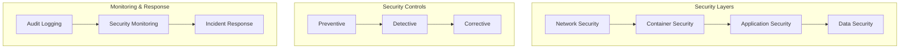

# Security Documentation

This directory contains comprehensive security documentation for the Burly MCP project. The documentation is organized to support different audiences and use cases.

## Documentation Overview

### 📋 [Threat Model](threat-model.md)
**Audience**: Security teams, architects, compliance officers  
**Purpose**: Comprehensive threat analysis using STRIDE methodology

- Complete threat landscape analysis
- Risk assessment matrix with likelihood and impact
- Attack scenarios and mitigation strategies
- Security controls mapping
- Assumptions and dependencies

### 🛡️ [Best Practices](best-practices.md)
**Audience**: DevOps engineers, system administrators, developers  
**Purpose**: Practical security implementation guidance

- Container security hardening
- Network security configuration
- Operational security procedures
- Development security practices
- Incident response procedures

### 🚨 [Vulnerability Reporting](vulnerability-reporting.md)
**Audience**: Security researchers, external contributors  
**Purpose**: Responsible disclosure process and guidelines

- How to report security vulnerabilities
- Coordinated disclosure timeline
- Severity classification criteria
- Recognition and rewards program
- Legal and ethical guidelines

### ⚙️ [Configuration Examples](configuration-examples.md)
**Audience**: DevOps engineers, system administrators  
**Purpose**: Secure configuration templates and examples

- Production environment configuration
- Docker security hardening examples
- Policy configuration templates
- Network security setup
- Automated security testing

## Quick Start Security Checklist

### For New Deployments

1. **Review Threat Model** - Understand the security landscape
2. **Follow Best Practices** - Implement security hardening
3. **Use Secure Configuration** - Apply configuration templates
4. **Run Security Validation** - Execute automated security checks
5. **Set Up Monitoring** - Implement security monitoring

### Security Validation

Run the automated security validation script:

```bash
# Basic validation
python scripts/security-validation.py

# Generate JSON report
python scripts/security-validation.py --report-format json --output security-report.json

# Validate specific project directory
python scripts/security-validation.py --project-root /path/to/burly-mcp
```

### Critical Security Requirements

#### ✅ Must Have (Critical)
- [ ] Container runs as non-root user (UID 1000)
- [ ] All capabilities dropped except essential ones
- [ ] Read-only root filesystem enabled
- [ ] Docker secrets used for sensitive data
- [ ] Audit logging enabled for all operations
- [ ] Input validation implemented for all user inputs
- [ ] Security policies configured and enforced

#### ⚠️ Should Have (High Priority)
- [ ] Network isolation configured
- [ ] Resource limits enforced
- [ ] Security monitoring and alerting set up
- [ ] Regular vulnerability scanning enabled
- [ ] Incident response procedures documented
- [ ] Security training completed for team

#### 💡 Nice to Have (Medium Priority)
- [ ] Advanced threat detection implemented
- [ ] Security metrics and dashboards
- [ ] Automated security testing in CI/CD
- [ ] Regular penetration testing scheduled
- [ ] Security awareness program established

## Security Architecture Overview



### Security Layers

1. **Network Security**
   - Firewall rules and network isolation
   - TLS encryption for external communications
   - Network segmentation and access controls

2. **Container Security**
   - Non-root execution and capability dropping
   - Read-only filesystems and resource limits
   - Security profiles and runtime protection

3. **Application Security**
   - Input validation and output sanitization
   - Policy-based access control
   - Secure coding practices and code review

4. **Data Security**
   - Encryption at rest and in transit
   - Secret management and key rotation
   - Data classification and access controls

## Security Tools and Scripts

### Validation Scripts
- `scripts/security-validation.py` - Comprehensive security configuration validation
- `docs/security/configuration-examples.md` - Security testing scripts and examples

### Configuration Templates
- Production Docker Compose with security hardening
- Environment variable templates with security warnings
- Policy configuration examples for different environments
- Network security configuration scripts

### Monitoring Tools
- Audit log analysis scripts
- Network connection monitoring
- Security event detection and alerting
- Vulnerability scanning automation

## Compliance and Standards

### Security Standards Compliance
- **OWASP Top 10** - Web application security risks
- **CIS Controls** - Critical security controls implementation
- **NIST Framework** - Cybersecurity framework guidelines
- **Container Security** - Docker and Kubernetes security best practices

### Audit Requirements
- **Log Retention**: 90 days minimum for audit logs
- **Access Reviews**: Quarterly review of permissions and policies
- **Vulnerability Management**: Monthly security scans and updates
- **Incident Documentation**: All security incidents documented and reviewed

### Privacy Considerations
- **Data Minimization**: Collect only necessary information
- **Purpose Limitation**: Use data only for intended purposes
- **Retention Limits**: Delete data when no longer needed
- **Access Controls**: Restrict access to authorized personnel only

## Getting Help

### Internal Resources
- **Security Team**: security@burly-mcp.org
- **Documentation**: This directory (`docs/security/`)
- **Validation Tools**: `scripts/security-validation.py`
- **Configuration Examples**: `docs/security/configuration-examples.md`

### External Resources
- **OWASP**: https://owasp.org/
- **Docker Security**: https://docs.docker.com/engine/security/
- **NIST Cybersecurity Framework**: https://www.nist.gov/cyberframework
- **CIS Controls**: https://www.cisecurity.org/controls/

### Emergency Contacts
- **Security Incidents**: security@burly-mcp.org
- **Emergency Hotline**: +1-555-SECURITY (24/7)
- **Escalation**: ciso@burly-mcp.org

## Contributing to Security Documentation

### Documentation Standards
- Use clear, actionable language
- Include practical examples and code snippets
- Provide both conceptual explanations and implementation details
- Keep documentation current with code changes

### Review Process
- All security documentation changes require security team review
- Technical accuracy verified by subject matter experts
- Regular reviews scheduled quarterly
- Community feedback incorporated through issues and pull requests

### Document Maintenance
- **Monthly**: Review for accuracy and completeness
- **Quarterly**: Update threat model and risk assessments
- **Annually**: Comprehensive security documentation audit
- **Ad-hoc**: Updates following security incidents or major changes

---

**Last Updated**: 2024-01-01  
**Next Review**: 2024-04-01  
**Document Owner**: Security Team  
**Classification**: Internal Use