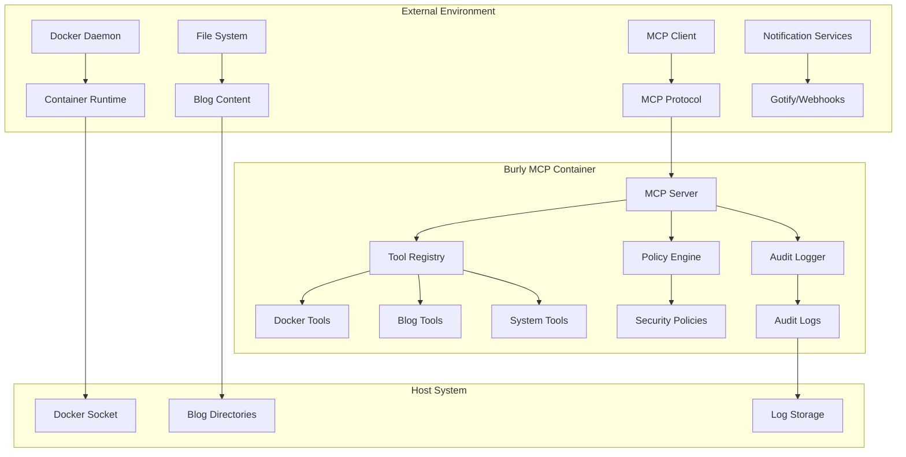

# Threat Model for Burly MCP

## Executive Summary

This document provides a comprehensive threat model for the Burly MCP (Model Context Protocol) server, identifying potential security threats, attack vectors, and corresponding mitigation strategies. The threat model follows the STRIDE methodology and focuses on the restructured Python package architecture.

## System Overview

### Architecture Components

### Trust Boundaries

1. **Container Boundary**: Between Burly MCP container and host system
2. **Process Boundary**: Between MCP server process and system processes
3. **Network Boundary**: Between MCP client and server
4. **File System Boundary**: Between application and host file system
5. **Service Boundary**: Between Burly MCP and external services

## Threat Analysis (STRIDE)

### Spoofing Threats

#### T1: MCP Client Impersonation
- **Description**: Malicious client impersonates legitimate MCP client
- **Impact**: Unauthorized tool execution, data access
- **Likelihood**: Medium
- **Mitigation**: 
  - Client authentication via API keys
  - Request signing and validation
  - Rate limiting per client
- **Detection**: Audit logging of client requests, anomaly detection

#### T2: Tool Identity Spoofing
- **Description**: Malicious tool masquerades as legitimate tool
- **Impact**: Privilege escalation, unauthorized operations
- **Likelihood**: Low
- **Mitigation**:
  - Whitelist-based tool registration
  - Tool signature verification
  - Immutable tool definitions
- **Detection**: Tool registry validation, audit logging

### Tampering Threats

#### T3: Configuration File Tampering
- **Description**: Unauthorized modification of policy or configuration files
- **Impact**: Security policy bypass, privilege escalation
- **Likelihood**: Medium
- **Mitigation**:
  - Read-only file system mounts
  - File integrity monitoring
  - Configuration validation on startup
- **Detection**: File checksum monitoring, audit logging

#### T4: Audit Log Tampering
- **Description**: Modification or deletion of audit logs
- **Impact**: Evidence destruction, compliance violations
- **Likelihood**: Medium
- **Mitigation**:
  - Append-only log files
  - Log forwarding to external systems
  - Log signing and verification
- **Detection**: Log integrity checks, external log correlation

#### T5: Docker Container Tampering
- **Description**: Runtime modification of container or processes
- **Impact**: Complete system compromise
- **Likelihood**: Low
- **Mitigation**:
  - Read-only root filesystem
  - Immutable container images
  - Runtime security monitoring
- **Detection**: Process monitoring, file system monitoring

### Repudiation Threats

#### T6: Action Repudiation
- **Description**: Users deny performing actions
- **Impact**: Accountability loss, compliance issues
- **Likelihood**: Medium
- **Mitigation**:
  - Comprehensive audit logging
  - Non-repudiation signatures
  - Tamper-evident logs
- **Detection**: Log correlation, digital signatures

### Information Disclosure Threats

#### T7: Sensitive Data Exposure in Logs
- **Description**: Secrets or sensitive data logged in plaintext
- **Impact**: Credential compromise, data breach
- **Likelihood**: High
- **Mitigation**:
  - Data sanitization in logs
  - Secret redaction patterns
  - Structured logging with field filtering
- **Detection**: Log content scanning, secret detection tools

#### T8: Container Information Disclosure
- **Description**: Exposure of host system information through container
- **Impact**: Information gathering for further attacks
- **Likelihood**: Medium
- **Mitigation**:
  - Minimal container privileges
  - Network isolation
  - Information filtering in tool outputs
- **Detection**: Output content analysis, network monitoring

#### T9: Path Traversal Information Disclosure
- **Description**: Unauthorized file system access via path manipulation
- **Impact**: Sensitive file exposure, system reconnaissance
- **Likelihood**: High
- **Mitigation**:
  - Strict path validation
  - Chroot-like restrictions
  - Input sanitization
- **Detection**: Path pattern monitoring, access logging

### Denial of Service Threats

#### T10: Resource Exhaustion
- **Description**: Excessive resource consumption causing service unavailability
- **Impact**: Service disruption, system instability
- **Likelihood**: High
- **Mitigation**:
  - Resource limits (CPU, memory, disk)
  - Request rate limiting
  - Timeout enforcement
- **Detection**: Resource monitoring, performance metrics

#### T11: Log Storage Exhaustion
- **Description**: Excessive logging fills available storage
- **Impact**: Service failure, log loss
- **Likelihood**: Medium
- **Mitigation**:
  - Log rotation and retention policies
  - Storage monitoring and alerts
  - Log compression
- **Detection**: Disk usage monitoring, log volume analysis

### Elevation of Privilege Threats

#### T12: Container Escape
- **Description**: Breaking out of container to access host system
- **Impact**: Complete host compromise
- **Likelihood**: Low
- **Mitigation**:
  - Non-root container execution
  - Capability dropping
  - Security profiles (AppArmor/SELinux)
- **Detection**: Runtime security monitoring, anomaly detection

#### T13: Docker Socket Abuse
- **Description**: Unauthorized Docker operations via socket access
- **Impact**: Container manipulation, host access
- **Likelihood**: Medium
- **Mitigation**:
  - Docker socket access controls
  - Operation whitelisting
  - Socket monitoring
- **Detection**: Docker API monitoring, audit logging

#### T14: Policy Engine Bypass
- **Description**: Circumventing security policies to execute unauthorized tools
- **Impact**: Unauthorized operations, privilege escalation
- **Likelihood**: Medium
- **Mitigation**:
  - Policy validation and enforcement
  - Fail-secure defaults
  - Policy integrity checks
- **Detection**: Policy violation logging, anomaly detection

## Attack Scenarios

### Scenario 1: Malicious MCP Client
1. **Initial Access**: Compromised MCP client connects to server
2. **Reconnaissance**: Client probes available tools and permissions
3. **Exploitation**: Client attempts path traversal or command injection
4. **Impact**: Unauthorized file access or command execution
5. **Mitigation**: Input validation, policy enforcement, audit logging

### Scenario 2: Container Escape Attack
1. **Initial Access**: Legitimate tool execution with malicious input
2. **Privilege Escalation**: Exploit container vulnerability or misconfiguration
3. **Lateral Movement**: Access host system resources
4. **Impact**: Host system compromise
5. **Mitigation**: Container hardening, runtime monitoring, least privilege

### Scenario 3: Supply Chain Attack
1. **Initial Compromise**: Malicious dependency introduced
2. **Code Execution**: Malicious code runs during tool execution
3. **Persistence**: Backdoor established in container or logs
4. **Impact**: Long-term unauthorized access
5. **Mitigation**: Dependency scanning, code signing, integrity monitoring

## Risk Assessment Matrix

| Threat ID | Threat | Likelihood | Impact | Risk Level | Priority |
|-----------|--------|------------|--------|------------|----------|
| T1 | MCP Client Impersonation | Medium | High | High | P1 |
| T2 | Tool Identity Spoofing | Low | High | Medium | P2 |
| T3 | Configuration Tampering | Medium | High | High | P1 |
| T4 | Audit Log Tampering | Medium | Medium | Medium | P2 |
| T5 | Container Tampering | Low | Critical | High | P1 |
| T6 | Action Repudiation | Medium | Low | Low | P3 |
| T7 | Sensitive Data in Logs | High | High | Critical | P0 |
| T8 | Container Info Disclosure | Medium | Medium | Medium | P2 |
| T9 | Path Traversal | High | High | Critical | P0 |
| T10 | Resource Exhaustion | High | Medium | High | P1 |
| T11 | Log Storage Exhaustion | Medium | Low | Low | P3 |
| T12 | Container Escape | Low | Critical | High | P1 |
| T13 | Docker Socket Abuse | Medium | High | High | P1 |
| T14 | Policy Engine Bypass | Medium | High | High | P1 |

## Security Controls Mapping

### Preventive Controls
- Input validation and sanitization
- Policy-based access control
- Container security hardening
- Network segmentation
- Least privilege principles

### Detective Controls
- Comprehensive audit logging
- Security monitoring and alerting
- Vulnerability scanning
- Anomaly detection
- File integrity monitoring

### Corrective Controls
- Incident response procedures
- Automated remediation
- Security patching processes
- Configuration management
- Backup and recovery

## Assumptions and Dependencies

### Security Assumptions
1. Host system is properly secured and maintained
2. Docker daemon is configured securely
3. Network infrastructure provides basic security
4. MCP clients are from trusted sources
5. External services (Gotify) are secure

### Dependencies
1. Docker security features (namespaces, cgroups, capabilities)
2. Host OS security controls (SELinux, AppArmor)
3. Container runtime security
4. Network security controls
5. External service security

## Threat Model Maintenance

### Review Schedule
- **Quarterly**: Full threat model review
- **Monthly**: Risk assessment updates
- **Ad-hoc**: After significant changes or incidents

### Update Triggers
- New features or components
- Security incidents or vulnerabilities
- Changes in threat landscape
- Regulatory or compliance changes
- Architecture modifications

### Stakeholders
- **Security Team**: Threat model ownership
- **Development Team**: Implementation guidance
- **Operations Team**: Monitoring and response
- **Compliance Team**: Regulatory requirements

---

**Document Version**: 1.0  
**Last Updated**: 2024-01-01  
**Next Review**: 2024-04-01  
**Owner**: Security Team  
**Approved By**: CISO